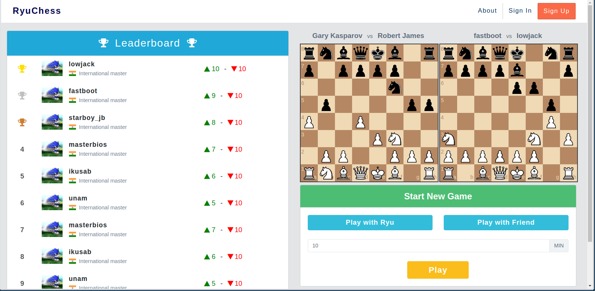

Ryu
===========

A Chess engine developed in python using Tornado and PostgreSQL.

Details
--------

:Author: Lowjack
:Email: harshit11541@gmail.com

Technical Specs
----------------

:Tornado: Async Python Web Library + Web Server
:PostgreSQL: Relational Database System

Requirements
~~~~~~~~~~~~~~~~~~~~~~~~~~~~~~~~~~~~~~~~~

1. python 3.6+
2. tornado
3. aiohttp
4. asyncpg
5. python-dateutil

Status - In Progress
--------------------

Overview
---------

This is how the application will look like

